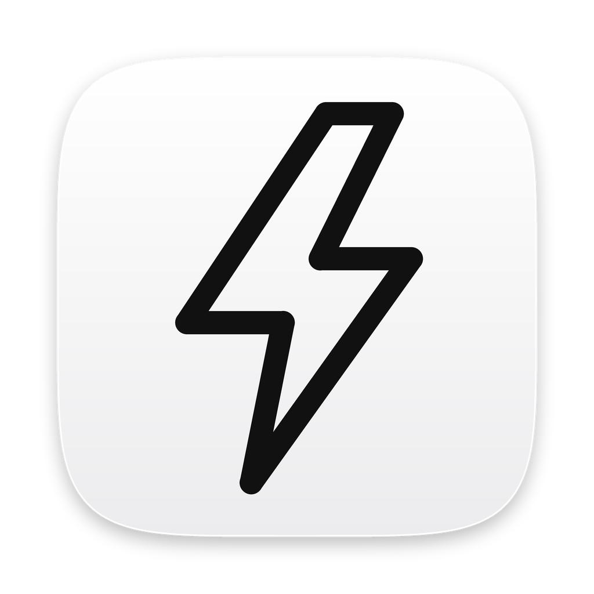
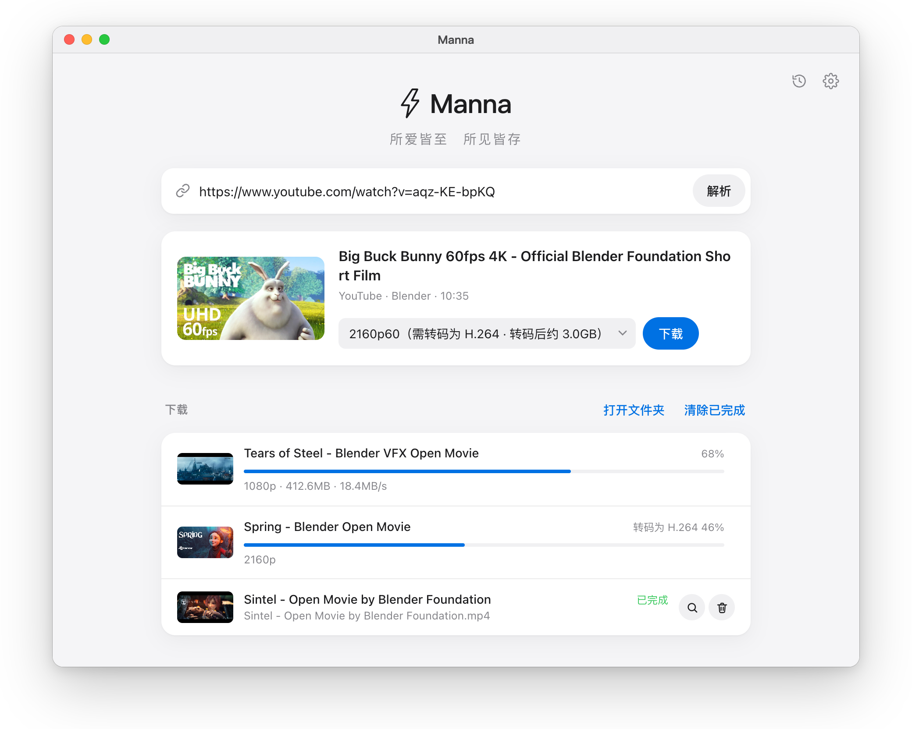
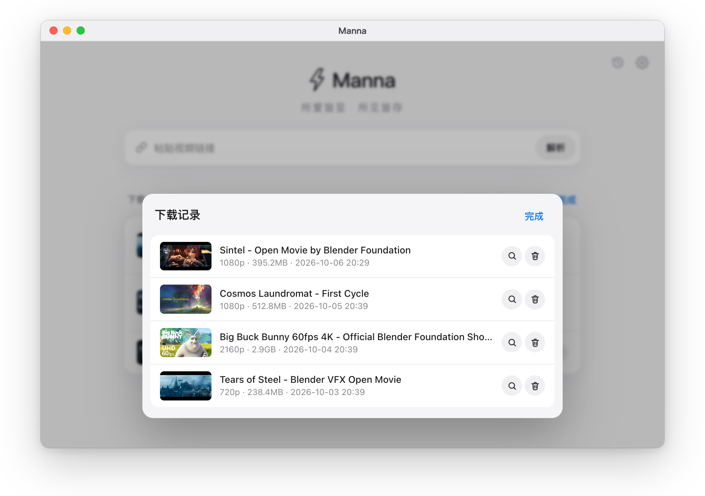

<p align="center">
  
</p>

<h1 align="center">Manna</h1>

<p align="center"><b>所爱皆至　所见皆存</b></p>

<p align="center">一个安静的 Mac 视频下载器。粘贴链接，选清晰度，得到一个哪里都能打开的 mp4。</p>

<p align="center">
  macOS · Apple 芯片 / Intel · 基于 <a href="https://github.com/yt-dlp/yt-dlp">yt-dlp</a> · <a href="LICENSE">MIT</a>
</p>

<p align="center">
  <picture>
    <source media="(prefers-color-scheme: dark)" srcset="docs/screenshots/main-dark.png">
    
  </picture>
</p>

---

## 为什么做 Manna

做视频的人，每天都在各个平台之间收集参考素材。
命令行太硬，网页下载站太吵，下回来的文件还常常是剪辑软件打不开的编码。
Manna 只想把这一件事做干净：一个窗口、一个输入框，下载回来的永远是 H.264 + AAC 的 mp4。
其余的，交给它在后台安静完成。

## 它能做什么

**粘贴即解析**
支持 YouTube、B站、TikTok、X、Instagram、Pinterest、小红书，以及 yt-dlp 支持的上千个网站。整段分享文字直接粘贴，b23.tv、xhslink.com 这类短链接会自动展开。

**清晰度一目了然**
解析后列出全部可用分辨率，附带编码与预估大小；也可以直接选「最高画质」或「仅音频（MP3）」。

**统一的成片格式**
只有 VP9 / AV1 等编码时，下载后自动转成 H.264，优先使用 Mac 的 VideoToolbox 硬件编码，码率按原片自动匹配，不虚胖。

**下载完会自己检查**
读取时长、解码开头 5 秒，发现问题会标出「可能花屏 / 不完整」。

**下载记录**
封面、标题、文件位置都留着，随时找回。

<p align="center">
  <picture>
    <source media="(prefers-color-scheme: dark)" srcset="docs/screenshots/history-dark.png">
    
  </picture>
</p>

**登录状态，只在本机**
自动使用你在浏览器里的登录状态，也可以导入 cookies.txt。Cookie 不离开这台电脑。

**自己保持最新**
yt-dlp 每天自动检查一次更新，也可以在设置里手动更新。

## 安装

目前需要自己打包，在终端运行：

```bash
./build_mac.command
```

需要 Python 3.10+（只在打包时用到）。几分钟后得到 `dist/<架构>/Manna.app` 和 .dmg，把 Manna.app 拖进「应用程序」即可。视频默认保存在「下载/Manna」。

## 使用前须知

**需要登录的网站**

| 网站 | 说明 |
|---|---|
| 小红书 | 建议登录 |
| Instagram | 多数内容需要登录 |
| B站 | 不登录最高 480p；1080P 需要登录，4K / 1080P60 需要大会员 |
| YouTube | 一般不需要；提示 "Sign in to confirm you're not a bot" 时再登录 |

Safari 的登录状态需要在「系统设置 → 隐私与安全性 → 完全磁盘访问权限」里打开 Manna。也可以用浏览器扩展导出 cookies.txt，在设置 →「高级」里填入。

**代理**
YouTube、X、Instagram、TikTok、Pinterest 在国内需要代理，在设置里填写，例如 `http://127.0.0.1:7890`。

**抖音与央视网**
抖音只读取官方公开分享页（单个视频 / 图集），画质较低、带水印；央视网通过 yt-dlp 下载公开的 270p 流。

## 边界

Manna 只使用网站公开提供的文件，以及你本人的登录状态。
它不去水印，不破解加密，不绕过付费或平台的访问限制。
**请只下载你有权保存的内容，并遵守各平台的使用条款与版权规定。**

<details>
<summary><b>给开发者：代码结构与配置</b></summary>

| 文件 | 作用 |
|---|---|
| `app.py` | 本地服务（127.0.0.1:8765）与接口：画质列表、登录信息选择、转 H.264、任务列表 |
| `index.html` | 界面 |
| `manna_app.py` | Mac 应用入口（pywebview 窗口） |
| `engines/base.py` | 引擎接口 `Extractor`：`match` / `inspect` / `download` |
| `engines/registry.py` | 引擎注册表：按优先级逐个尝试，失败自动换下一个 |
| `engines/ytdlp.py` | yt-dlp 引擎（全部网站），以子进程运行 |
| `engines/douyin.py` | 抖音公开分享页（单个视频、图集），失败时换 yt-dlp |
| `history.py` | 下载记录 |
| `shortlinks.py` | 短链接展开 |
| `tools.py` | 外部工具 yt-dlp / ffmpeg / Deno：查找、版本检查、缺失提示 |
| `ytdlp_runner.py` | 打包后让 Manna 自己运行 yt-dlp（`Manna --manna-yt-dlp …`） |
| `smoke_test.py` | 冒烟测试：各平台解析 + 下载最低画质 |

外部工具默认使用 Manna 自带的版本，也可以在 `~/Library/Application Support/Manna/config.json` 里指定路径：

```json
{"tools": {"yt-dlp": "/opt/homebrew/bin/yt-dlp", "ffmpeg": "/opt/homebrew/bin/ffmpeg", "deno": "/opt/homebrew/bin/deno"}}
```

日志在同一目录的 `manna.log`。

</details>

## 致谢与许可

截图中的影片均为 Blender Foundation 的开放电影（Big Buck Bunny、Sintel、Tears of Steel、Spring、Cosmos Laundromat），以 CC BY 许可发布，© Blender Foundation | blender.org。


Manna 站在这些开源项目的肩膀上。打包时它们会被放进 Manna.app（不在本仓库中，由 `build_mac.command` 下载）：

| 软件 | 许可 | 源码 |
|---|---|---|
| yt-dlp（含 yt-dlp-ejs） | Unlicense（yt-dlp-ejs 另含 MIT / ISC 部分） | https://github.com/yt-dlp/yt-dlp |
| FFmpeg（经 imageio-ffmpeg 提供） | GPL v2 或更高版本 | https://ffmpeg.org/download.html ；未修改，原样调用其可执行文件 |
| Deno | MIT | https://github.com/denoland/deno |
| imageio-ffmpeg | BSD-2-Clause | https://github.com/imageio/imageio-ffmpeg |
| pywebview | BSD-3-Clause | https://github.com/r0x0r/pywebview |
| PyInstaller | GPL v2+ 及打包例外条款 | https://github.com/pyinstaller/pyinstaller |
| Python | PSF License | https://www.python.org |
| mutagen | GPL v2 或更高版本 | https://github.com/quodlibet/mutagen |

完整许可证文本随应用提供（设置 →「查看完整许可证文本」）。

Manna 自身的代码以 [MIT 许可](LICENSE) 发布。

---

## English

**Manna** is a quiet video downloader for macOS, built on [yt-dlp](https://github.com/yt-dlp/yt-dlp).
Paste a link, pick a quality, and get an H.264 + AAC mp4 that opens in any editor.

- Works with YouTube, Bilibili, TikTok, X, Instagram, Pinterest, Xiaohongshu and the many other sites yt-dlp supports.
- Lists every available resolution with codec and estimated size; "best quality" and audio-only (MP3) are one click away.
- VP9 / AV1 sources are transcoded to H.264 with VideoToolbox hardware encoding, at a bitrate matched to the source.
- Each download is checked (duration + first 5 seconds decoded), and kept in a history with thumbnails.
- Uses your own browser sign-in or a cookies.txt file; cookies never leave your Mac.

Build with `./build_mac.command` (Python 3.10+ required at build time only).
Manna uses only publicly served files and your own sign-in. It does not remove watermarks or bypass DRM, paywalls or platform access controls. Download only content you have the right to keep.

Screenshots show Blender Foundation open movies (CC BY, © Blender Foundation | blender.org).

Released under the [MIT License](LICENSE).
